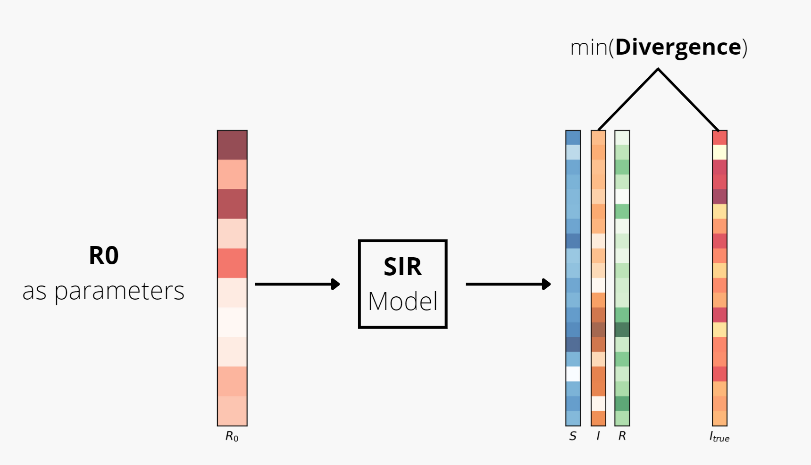

# Pandemic Simulation and $R_0$ Estimation

This is the repository for the final group project of 94-867 Decision Analytics for Business and Policy class (Spring, 2022) at CMU. The main idea of this project is to estimate the basic reproduction number of CoVID-19 overtime by simulating the pandemic using the dynamic SIR model.

We formulate the estimating problem as a non-linear optimization problem described in the diagram below -- we employ Nelder-Mead method to vary the $R_0$ value overtime to minimize the divergence between the predicted and true daily active cases.



## How to run it

Code and intermediate results are saved in the [`nbs/SIR_param_estimation.ipynb`](nbs/SIR_param_estimation.ipynb). Run all the cells in the notebook to execute the whole pipeline.

Results are stored in the [`results`](results/) folder as pickles in `.npy` format. Load them with the `numpy.load()` function to extract the optimized results.

## Repo Structure

```
├── archive
├── data
│   ├── CA.txt
│   ├── IL.txt
│   ├── NJ.txt
│   ├── NY.txt
│   └── PA.txt
├── nbs
│   ├── SIR_param_estimation.ipynb
│   └── SIR_param_estimation_visual.ipynb
├── img
├── results
│   ├── est_r0_ca_mse.npy
│   ├── est_r0_il_mse.npy
│   ├── est_r0_nj_mse.npy
│   ├── est_r0_ny_mse.npy
│   ├── est_r0_pa_mse.npy
│   ├── I_ca_mse.npy
│   ├── I_il_mse.npy
│   ├── I_nj_mse.npy
│   ├── I_ny_mse.npy
│   └── I_pa_mse.npy
├── loss_func.py
└── README.md
```